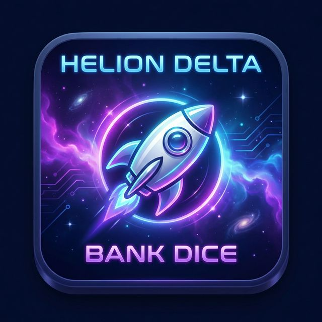

# 🚀 HELION DELTA - Bank-Dice



**App de dados y banca para el juego de mesa Helion Delta**

Una aplicación web progresiva (PWA) que funciona como banco digital y sistema de dados para el juego de mesa Helion Delta, compatible tanto con la versión **1vs1** como con la de **hasta 4 jugadores**.

---

## 🎮 ¿Qué es Helion Delta?

Helion Delta es un juego de mesa espacial donde los jugadores:
- 🪐 Conquistan planetas para generar ingresos
- 💰 Gestionan su banco de monedas
- 🚀 Compran naves y mejoras
- ⭐ Añaden potenciadores para multiplicar ganancias

Esta app reemplaza los dados físicos y facilita la gestión de monedas y recursos.

---

## ✨ Características

### 🎲 Sistema de Dados
- Un dado virtual con animaciones
- Visualización clara y atractiva del resultado
- Animación suave al lanzar
- Historial de las últimas 5 tiradas

### 🏦 Sistema de Banca
- **Gestión de monedas** para cada jugador
- **Cobro automático de ingresos** basado en:
  - Base fija de 2 monedas
  - +1 moneda por planeta conquistado
  - +1 extra si posees el planeta central
  - +1 por cada grupo de planetas completado
  - Bonificación por potenciadores activos

### 🪐 Gestión de Planetas
- Contador de planetas normales
- Indicador de planeta central (×2 multiplicador)
- Sistema de grupos de planetas
- Ajustes rápidos con botones +/-

### 🚀 Potenciadores
- Planetas normales (×1) o centrales (×2)
- Duración personalizable: 1, 2, 3 rondas o infinito
- Vista previa de monedas totales
- Gestión visual con cuenta regresiva
- Opción de eliminar potenciadores

### 🛒 Sistema de Compras
- Tienda integrada con 4 tipos de naves
- Costos: 3, 6, 15, 20 monedas
- Venta rápida de cartas (+1 moneda)
- Verificación automática de fondos

### 🎯 Acciones Especiales
- **Robar Planeta**: Transferir planetas entre jugadores (con opción de transferir potenciadores)
- **Intercambiar Huchas**: Swap completo de monedas entre dos jugadores
- **Ajuste Manual**: Añadir/quitar monedas manualmente

### 👥 Multijugador
- **2-4 jugadores** (compatible 1vs1 y hasta 4)
- **Nombres personalizables** para cada jugador
- **Colores únicos** para identificar a cada jugador
- **Persistencia de datos**: El progreso se guarda automáticamente

---

## 📱 Instalación

### Opción 1: Usar Online
Visita la app desplegada en GitHub Pages:
```
https://erppjr.github.io/HD-Bank-Dice/
```

### Opción 2: Usar Localmente
```bash
# Simplemente abre el archivo en tu navegador
# No requiere servidor
index.html
```

---

## 🎯 Cómo Usar

### 1️⃣ Configuración Inicial
1. Al abrir la app, verás la pantalla de **HELION DELTA**
2. Click en **"🎲 Comenzar"**
3. Ve a la pestaña **"🏦 Banca"**
4. Selecciona el número de jugadores (2, 3 o 4)
5. Personaliza los nombres de los jugadores
6. Click en **"Comenzar Partida"**

### 2️⃣ Durante el Juego

#### Tirar Dado:
- Ve a la pestaña **"🎲 Dados"**
- Click en **"🎲 Tirar Dados"**
- El dado se animará y mostrará el resultado

#### Gestionar Planetas:
- Usa los botones **+/-** para ajustar planetas
- Activa el toggle **⭐ Central** si conquistas el planeta central
- Ajusta la cantida de **grupos** de planetas completados

#### Cobrar Ingresos:
- Click en **"💰 Cobrar"** en la tarjeta del jugador
- Las monedas se añaden automáticamente
- Los potenciadores se deducen automáticamente

#### Añadir Potenciadores:
- Click en **"➕ Potenciador"**
- Selecciona tipo de planeta (Normal/Central)
- Elige duración (1-3 rondas o infinito)
- Confirma

#### Comprar:
- Click en **"🛒 Comprar"**
- Selecciona el artículo
- Las monedas se deducen automáticamente

#### Acciones Especiales:
- **🏴‍☠️ Robar Planeta**: Transfiere un planeta (y opcionalmente un potenciador) de un jugador a otro
- **🔄 Intercambiar Huchas**: Intercambia las monedas totales entre dos jugadores

### 3️⃣ Finalizar/Reiniciar
- Click en **"🔄 Nueva Partida"** para reiniciar
- Confirma la acción

---

## 🛠️ Tecnologías

- **HTML5** - Estructura semántica
- **CSS3** - Diseño moderno con animaciones
- **JavaScript Vanilla** - Sin dependencias
- **PWA** - Service Worker para funcionalidad offline
- **LocalStorage** - Persistencia de datos

---

## 📂 Estructura del Proyecto

```
bank-dice/
├── index.html          # Estructura principal
├── style.css           # Estilos y animaciones
├── app.js              # Lógica del juego
├── manifest.json       # Configuración PWA
├── sw.js              # Service Worker
├── icon-192.png       # Icono pequeño
├── icon-512.png       # Icono grande
├── README.md          # Este archivo
└── ICONOS.md          # Guía para iconos
```

---

## 🎨 Características de Diseño

- **Tema espacial cósmico** con gradientes púrpura y azul
- **Animaciones suaves** en todas las interacciones
- **Diseño responsive** optimizado para móviles
- **Pantalla de inicio** con logo animado
- **Tarjetas de jugador** con colores únicos
- **Modales personalizados** compatibles con iOS
- **Efectos de brillo** y sombras para profundidad

---

## 💾 Datos del Juego

Los datos se guardan automáticamente en `localStorage`:
- Estado de cada jugador (monedas, planetas, potenciadores)
- Nombres personalizados
- Configuración de la partida

**Nota**: Los datos persisten incluso al cerrar el navegador.

---

## 📋 Compatibilidad

| Plataforma | Soporte |
|------------|---------|
| **Android** | ✅ Completo |
| **iOS** | ✅ Completo |
| **Chrome Desktop** | ✅ Completo |
| **Firefox** | ✅ Completo |
| **Safari** | ✅ Completo |
| **Edge** | ✅ Completo |

---

## 🎮 Modos de Juego Soportados

### 🥊 Modo 1 vs 1
Perfecto para partidas rápidas entre dos jugadores. La app gestiona:
- 2 bancos independientes
- Sistema de robo de planetas entre jugadores
- Intercambio de huchas

### 👥 Modo 4 Jugadores
Ideal para partidas completas. Soporta:
- Hasta 4 jugadores simultáneos
- Gestión individual de recursos
- Colores únicos para cada jugador (púrpura, azul, dorado, rosa)
- Acciones especiales entre cualquier combinación de jugadores

---

## 📝 Licencia

Este proyecto es de código abierto. Siéntete libre de usarlo y modificarlo para tus partidas de Helion Delta.

---

## 🙏 Créditos

Desarrollado por erppjr para facilitar el desarrollo y mejorar la experiencia del juego de mesa **Helion Delta**.

---

## 📞 Soporte

¿Problemas o sugerencias? Abre un issue en el repositorio de GitHub.

---

¡Que disfrutes de tus partidas de Helion Delta! 🚀🎲🪐
